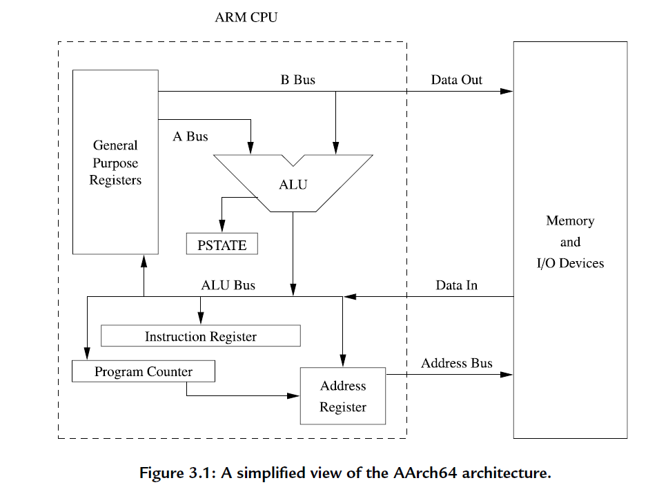
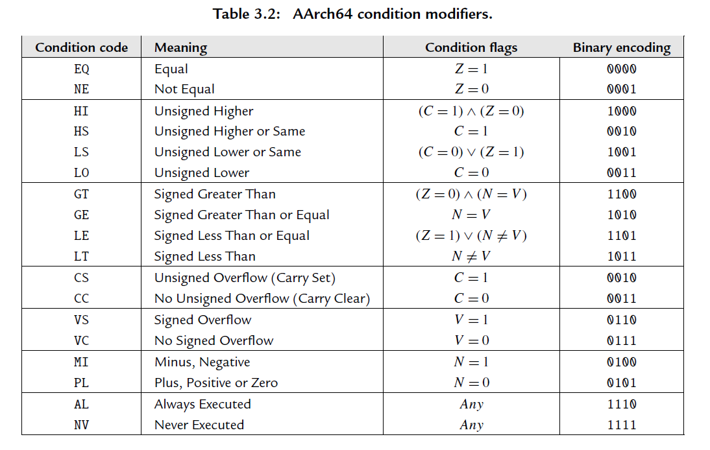
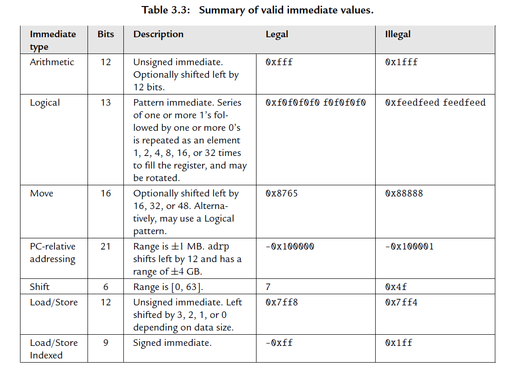
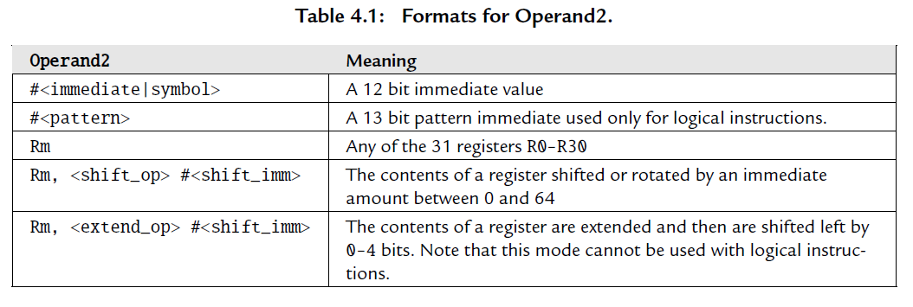

[toc]

# 汇编语言

## 汇编程序的构成

Label

Directives 伪指令 没有对应的机器码 和 汇编编译器 有关

Assembly instructions 和 CPU 架构有关

Comments 

## 编译与构建

### 交叉编译 Cross Compiler

在 A 平台上编译运行在 B 平台的代码

### 编译工具链

按架构区分   LLVM 和 GNU 工具链

按执行或目标平台区分  Linux Windows Mac Android    x86 ARM

GNU binutils

[Documentation for binutils 2.39 (sourceware.org)](https://sourceware.org/binutils/docs/)

[GNU make](https://www.gnu.org/software/make/manual/make.html)

| 工具    | 功能                                                         |
| ------- | ------------------------------------------------------------ |
| as      | 汇编编译器                                                   |
| ld      | linker 链接器                                                |
| gcc     | C/C++ 编译器(驱动)                                           |
| objcopy | convert ELF executable into IMG format                       |
| objdump | utility to disassemble executables (for debugging)           |
| readelf | an useful utility to dump sections and segments in executables (for debugging) |
| gdb     | debug tool                                                   |
| make    | 构建工具                                                     |

```shell
gcc -g <...> # 带上 -g 选项
gdb program # 进入 gdb 交互界面 (gdb)
# 忘了调试命令时 使用 info 查看

gcc main.s -o main

// or
as main.s -o main.o
ld main.o -o main

gcc main.s -o main -nostartfiles
```


### 编写 link script

[Scripts (LD) (sourceware.org)](https://sourceware.org/binutils/docs/ld/Scripts.html)

[Using LD, the GNU linker](https://ftp.gnu.org/old-gnu/Manuals/ld-2.9.1/html_mono/ld.html#SEC1)

### 编写 Makefile

## CALL

Comiler Assembler Linker Loader

### ELF

# x86

## 8086


## x64

AT&T Intel

# ARM

## ARM64

ARM v8 AArch64



### ARMv8 寄存器

#### General purpose registers

x0 - x30 共计31个

x29 Frame pointer

x30 Likn register

#### Special registers

Zero register

Program counter

Stack pointer * 4 SP_EL0 - SP_EL3

Program Status Register SPSR_EL1 - SPSR_EL3

Exception Link Register  ELR_EL1 - ELR_EL3

#### System registers

### ARMv8 Exception

> Strictly speaking, an interrupt is something that interrupts the flow of software execution.  However, in ARM terminology, that is actually an exception. Exceptions are conditions or  system events that require some action by privileged software (an exception handler) to ensure  smooth functioning of the system. There is an exception handler associated with each exception  type. Once the exception has been handled, privileged software prepares the core to resume  whatever it was doing before taking the exception.

#### Exception levels

运行模式/工作模式/权限级别

ARM v8 的 Exception levels 类似于 ARM v7 的 processor mode

一个 Exception level 对应一个 Privilege level

每个 level 可以访问的 寄存器 也不同

| Exception level | Note                                                      |
| --------------- | --------------------------------------------------------- |
| EL0             | Normal user applications                                  |
| EL1             | Operating system kernel typically described as privileged |
| EL2             | Hypervisor                                                |
| EL3             | Low-level firmware, including the Secure Monitor.         |

Execution state  AArch64 和 AArch32

### 指令集

Instruction set architecture  ISA 对硬件(CPU)的一种抽象

T32 A32 A64

mnemonics 助记符

一条指令的构成如下

```
MNEMONIC{S}{condition} {Rd}, Operand1, Operand2

MNEMONIC     - 操作指令（机器码对应的助记符）。
{S}          - 可选后缀. 如果指定了该后缀，那么条件标志将根据操作结果进行更新。
{condition}  - 执行指令所需满足的条件。
{Rd}         - 目标寄存器，存储操作结果。
Operand1     - 第一操作数（寄存器或者立即数）
Operand2     - 第二操作数. 立即数或者带有位移操作后缀（可选）的寄存器。
```

#### Condition



#### Immediate values

> An immediate value in assembly language is a constant value that is specified by the programmer.
> Some assembly languages **encode the immediate value as part of the instruction**. Other
> assembly languages **create a table of immediate values in a literal pool**, stored in memory, and
> insert appropriate instructions to access them. ARM assembly language provides both methods.

立即数

```assembly
#<immediate | symbol>
=<immediate | symbol> // 只能用在 ldr 伪指令 详见 Addressing modes.relative modes 一节
```

> 可以优先使用 #<immediate | symbol>，报错时再替换为 =<immediate | symbol>
>
> The =<immediate|symbol> syntax can be used to specify any immediate value (up to 64-bits), or to specify the 64-bit value of any symbol in the program.
>
> When an immediate value is necessary, the programmer can always use the #<immediate|symbol> syntax. The assembler will emit an error message when an invalid immediate value is attempted, and the programmer
> can change their code to use the ldr Rx,=<immediate|symbol> method instead.



#### Operand2



#### Load/Store

```assembly
// Load/store single register
ldr sdr <op>{<size>} Rd, <addr>
// <size> b h sb sh sw
// <addr> 为 addressing mode 中的一种

// Load/store single register (unscaled)
ldur sdur <op>{<size>} Rd, [Xn, #imm9]
// <size> b h sb sh sw

// Load/store pair
ldp sdp
<op>{<size>} Rt, Rt2, <addr>
// <size> is optionally sw for signed words.
// <addr> is 7 bits Pre-indexed, Post-indexed, or Signed immediate.
// Signed immediate Xt range: [-0x200, 0x1f8]. Wt range: [-0x100, 0xfc]

// str/stur/stp 不能指定 signed <size>, 也不不能使用 literal addressing mode.
```

> Programmers rarely need to write ldur or stur explicitly. The programmer can just use ldr or str, and the
> assembler will almost always automatically convert them to ldur or stur when appropriate.

从 memory 中读取数据存入寄存器中

> As with all prior ARM processors, the ARMv8 architecture is a **Load/Store architecture**. This
> means that no data processing instruction operates directly on data in memory. The data must
> first be loaded into registers, modified, and then stored to memory. The program must specify
> an address, the size of data to be transferred, and a source or destination register
>
> 计算指令只能修改寄存器，不能直接操作主存

##### Addressing modes

###### offset modes

```Ass
[Xn | sp] // Register Address
[Xn|sp, #±<imm9>] // Signed Immediate Offset
[Xn|sp, #<imm12>] // Unsigned Immediate Offset
```

###### index modes

```
[Xn|sp, #±<imm9>]! // Pre-indexed Immediate Offset
[Xn|sp], #±<imm9> // Post-indexed Immediate Offset
```

既会从 memory 中读取数据，也会更新地址寄存器

###### PC-relative modes

```assembly
=<immediate|symbol> // Pseudo Load
```


指令中的立即数，一种是直接编入指令对应的机器码，一种是存入 literal pool，以 PC 寄存器为基址进行访问

> literal pool
>
> A64 adds another addressing mode specifically for accessing literal pools. Literal pools are
> blocks of data encoded in an instruction stream. The pools are not executed, but their data can
> be accessed from surrounding code using PC-relative memory addresses. Literal pools are often
> used to encode constant values that do not fit into a simple move-immediate instruction.

```assembly
.text
ldr x0, =0x123456789abcdef0
ret

// disassembly
0: 58000040 ldr x0, 8 <.text+0x8>
4: d65f03c0 ret
8: 9abcdef0 .word 0x9abcdef0
c: 12345678 .word 0x12345678
```


#### Branch

```assembly
// Branch
b{<cond>} <target_label>

// Branch register
br Xn
ret {Xn} // 默认 X30

// Branch and link 当前 PC 指向的地址存入 X30，方面稍后返回
bl <target_address> // x30 <-- pc + 4  pc <--- target_address
blr Xn // X30 <-- pc +4 pc <-- Xn

// compare and branch
cb{n}z Rt, <label> // Compare and Branch if Zero or Nonzerov
tb{n}z Rt, #imm6, <label> // Test Bit and Branch if Zero or Nonzero

// Form Pc-relative address
<adr | adrp> Rd, <label>
adr Rd, <label> // ldr Rx, =label

```


#### Data processing and othre

> Most of the data processing instructions are three address instructions, because they involve
> two source operands and produce one result. For most instructions, the second source operand
> can be a register, a rotated or shifted register, or an immediate value

##### 算数运算

##### 逻辑运算

比较运算 位运算

```
clz Count Leading Zeros and
cls Count Leading Sign Bits.
```

##### mov 指令

将数据从一个寄存器复制到另一个寄存器，或将一个立即数写到一个寄存器

```asm
mov r1, r0 # 将 r0 复制到 r1
```


#### System control and other

###  Application Binary Interface

> The Application Binary Interface (ABI) for the ARM Architecture specifies fundamental rules  to which all executable native code modules must adhere so that they can work correctly  together. These fundamental rules are supplemented by additional rules for specific  programming languages (for example, C++). Individual operating systems or execution  environments (for example, Linux) may specify additional rules to meet their own specific  requirements, beyond those rules specified by the ARM ABI


# 参考资料

1. CSAPP 深入理解计算机系统 第三章 程序的机器级表示 第七章 链接

2. 汇编语言 王爽
3. ARM 64Bit Assembly Language   Larry D.Pyeatt
4. [bztsrc/raspi3-tutorial: Bare metal Raspberry Pi 3 tutorials (github.com)](https://github.com/bztsrc/raspi3-tutorial/)
5. [isometimes/rpi4-osdev: Tutorial: Writing a "bare metal" operating system for Raspberry Pi 4 (github.com)](https://github.com/isometimes/rpi4-osdev)
6. [ARM汇编语言入门（三） - 知乎 (zhihu.com)](https://zhuanlan.zhihu.com/p/109537645)
7. https://modexp.wordpress.com/2018/10/30/arm64-assembly/

