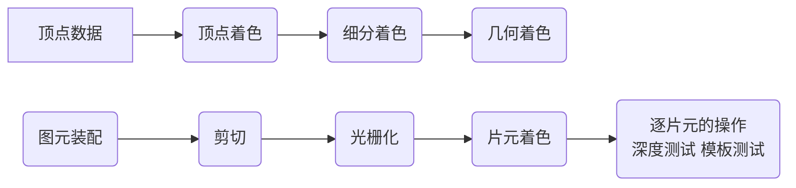

[toc]

## OpenGL 基本概念

### 什么是OpenGL

OpenGL是一个由[Khronos组织](http://www.khronos.org/)制定并维护的规范(Specification)，OpenGL规范严格规定了每个函数该如何执行，以及它们的输出值。至于内部具体每个函数是如何实现(Implement)的，将由OpenGL库的开发者自行决定，实际的OpenGL库的开发者通常是显卡的生产商

**检测设备OpegnGL版本、实现厂商、显卡等相关信息**

   OpenGL Extensions Viewer

​	http://www.realtech-vr.com/home/glview

**客户端/服务器架构**

### OpenGL的对象

在OpenGL中一个对象是指一些选项的集合，它代表OpenGL状态的一个子集，每一个对象用一个无符号整型标记

常见的对象:

- **缓冲对象**

  存储一些数据 

  **顶点缓冲对象 VBO**	**索引缓冲对象 EBO/IBO**  **纹理缓冲对象TBO** 

- **其他对象**

  **顶点数组对象 VAO**	**着色器对象**  **纹理对象**

**对象的一般使用方法:**

```C++
// 创建对象
unsigned int objectId = 0;
glGenObject(1, &objectId); // 或 glCreate*()
// 绑定对象至上下文
glBindObject(GL_WINDOW_TARGET, objectId);
// 设置当前绑定到 GL_WINDOW_TARGET 的对象的一些选项
glSetObjectOption(GL_WINDOW_TARGET, GL_OPTION_WINDOW_WIDTH, 800);
glSetObjectOption(GL_WINDOW_TARGET, GL_OPTION_WINDOW_HEIGHT, 600);
// 将上下文对象设回默认
glBindObject(GL_WINDOW_TARGET, 0);
```

4.5版本后，可以不需要先绑定到一个**目标**上，再通过对**目标**的操作操作缓冲对象，而是直接使用 `glNamed*` 函数指定对某个缓冲对象进行操作

**缓冲对象的使用**

### VAO、VBO、EBO 

一个 vao 对应多个 vbo, 一个 ebo

当该 vao 处于绑定状态，所有对 vbo 和 ebo 的配置储存在该 vao 中

一个顶点数组对象会储存以下这些内容：

- glEnableVertexAttribArray和glDisableVertexAttribArray的调用。
- 通过glVertexAttribPointer设置的顶点属性配置。
- 通过glVertexAttribPointer调用与顶点属性关联的顶点缓冲对象。
- 目标是GL_ELEMENT_ARRAY_BUFFER的glBindBuffer的函数调用


`glVertexAttribPointer` 把前绑定到 目标 `GL_ARRAY_BUFFER` 的 vbo，与当前绑定 vao 关联，为其指定 vbo 中的数据，并指明如何解释 vbo 中的数据 (每组数据大小，类型等信息)，`glEnableVertexAttribArray` 和 `glDisableVertexAttribArray` 用于打开或关闭 当前绑定的 vao 的某个属性

### OpenGL的上下文

OpenGL自身是一个巨大的状态机(State Machine)：一系列的变量描述OpenGL此刻应当如何运行。OpenGL的状态通常被称为OpenGL上下文(Context)。我们通常使用如下途径去更改OpenGL状态：设置选项，操作缓冲。最后，我们使用当前OpenGL上下文来渲染。

一般可以使用第三方库来创建OpenGL上下文，例如 GLFW, GLEW, glut, freeglut

创建上下文的伪代码(pseudocode)

```C
#include <libraryheaders>
int main()
{
    createWindow(title, width, height);
    createOpenGLContext(settings);
    while (windowOpen)
    {
        while (event = newEvent())
            handleEvent(event);
        updateScene();
        drawGraphics();
        presentGraphics(); //更换缓冲
    }
    return 0;
}
```

### 渲染管线



## 着色器


### GLSL

## OpenGL绘制方式

### OpenGL图元

**点**

​	屏幕的一个**四边形区域**来模拟点

​	当`GL_PROGRAM_POINT_SIZE`关闭时， `glPointSize` 可以用于设置点的大小，开启后，可以在顶点、细分和几何着色器中向内置变量 `gl_PointSize` 写入值来进行改变

**图元绘制方式**

glDrawArray 

glDrawElements

## 坐标系统

### 坐标和空间

**局部空间/物体空间**

​	建模，描述物体的形状

**世界空间**

​	描述物体之间的位置关系

**观察空间/摄像机空间/视觉空间**

​	摄像机视角观察到的画面

**裁剪空间**

​	空间之内的点被保留，之外的被裁剪

​	顶点着色器的输出要求所有的顶点都在裁剪空间内
$$
V_{clip} = M_{projection} \cdot M_{view} \cdot M_{model} \cdot V_{locap}
$$
**齐次坐标**

1. 可以进一步完成透视转换
2. 可以使用线性变换来实现模型的平移，也就是可以通过矩阵的乘法完成平移

**屏幕坐标**

### 变换

从模型数据到屏幕上的像素经历了**用户变换**、**透视除法**、**视口变换**

**用户变换**

​	输入初始模型坐标，输出用于透视除法的**齐次坐标**，也就是**裁剪坐标**

​	在渲染管线的**顶点着色阶段**、**细分着色阶段**和**几何着色阶段**完成**模型变换**、**视图变换**、**投影变换**

**透视除法**

​	OpenGL 对**裁剪坐标**执行透视除法从而将他们变换到**标准化设备坐标**

**视口变换**

OpenGL 使用 `glViewPort` 内部的参数来将**标准化设备坐标映**射到**屏幕坐标**，每个坐标都关联了一个屏幕上的点

`glViewPort` 指定的坐标，坐标原点在屏幕右下角


## 参考网站

https://learnopengl-cn.github.io/

https://open.gl/

https://learnopengl.com/

https://antongerdelan.net/opengl/

https://www.khronos.org/opengl/

https://www.opengl.org/
