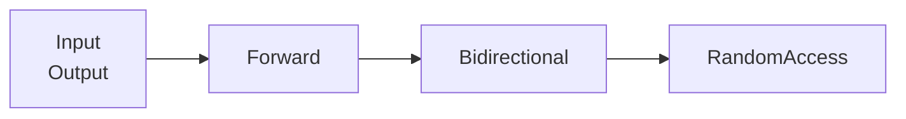

[toc]

## C++ 面向对象

### 封装

如何定义一个类？**struct class**

#### 访问控制

|         | 自己/友元 | 子类 | 其他 |
| :-----: | :-------: | :--: | :--: |
| private |     ✔     |  ❌   |  ❌   |
| product |     ✔     |  ✔   |  ❌   |
| public  |     ✔     |  ✔   |  ✔   |

**using** 声明可以改变个别成员的可访问性

派生类只能为那些它可以访问的名字提供 **using** 声明

**派生类向基类转换的可访问性**

受所在代码位置以及继承方式的影响

D 继承 B

|         | D的友元/成员函数 | D的派生类友元/成员函数 | 用户代码 |
| ------- | ---------------- | ---------------------- | -------- |
| private | ✔                | ❌                      | ❌        |
| product | ✔                | ✔                      | ❌        |
| public  | ✔                | ✔                      | ✔        |


#### 属性/数据成员

static const mutable

**数据成员初始化**

1. **非静态成员** C++11之前不能在类内进行初始化，C++11起可以在类内直接进行初始化，初始化时只能使用 `=` 或者 `{}` 初始化，不能使用 `()`

   ```C++
   class MyClass {
       int x = 1;
       vector<int> arr = vector<int>arr(10);
       vector<int> arr = {0, 1, 2, 3, 4}; // 列表初始化
       // vector<int> arrr(10) ❌
   }
   ```

2. **静态非常量**成员只能在类定义之外初始化

   ```c++
   class MyClass {
       static int x;
   };
   int MyClass::x = 0;
   ```

3. **静态常量成员**

   ```C++
   //C++11 之前任何类型静态常量成员都可以在类内初始化
   class MyClass {
       static const int x = 0;
       static const float  y= 1.0f;
   }
   //C++11 起只有整形或者静态constexpr成员才可以在类内初始化
   class MyClass {
       static const int x = 0;
       static constexpr float y = 1.0f;
       // static const float z = 1.0f; ❌
       static const float z;
   }
   const float MyClass::z = 1.0f;
   ```

   

mutable mutable数据成员在任何时候都是可变的


#### 成员函数

static  volatile virtual 

const  final override & && (引用限定符)

类内定义的成员函数默认为 inline 函数

const 对象只能调用 const 成员函数

override 显示指定该成员函数重写父类函数

final 禁止派生类重写

引用限定符可以是 & 和 && ，分别指出 this 可以指向一个左值或者右值

如果一个成员函数有引用限定符，则和其重载的都必须有引用限定符

#### 特殊成员函数

这些函数编译器大多会提供默认的实现，使用 **default** 可以现实指定使用默认实现，使用 **delete** 可以禁止默认实现。这些函数和对象的**构造/初始化**、**赋值(=)/复制/拷贝**、**移动**、**类型转换**、**销毁/析构** 有关。

编译器会提供一下函数的默认实现:

1. 默认构造函数 无参 什么也不做 没有任何构造函数时提供
2. 析构函数  什么也不做
3. 拷贝构造函数 按成员拷贝 浅拷贝 没有定义拷贝构造函数时提供
4. 重载拷贝赋值运算符函数(=) 对应属性赋值 浅拷贝 没有重载复制运算符函数
5. 移动构造函数(C++11)
6. 重载移动赋值运算符函数(C++11)  

[拷贝构造函数和重载赋值运算符函数区别](# 拷贝构造函数和赋值操作符的区别)

**构造函数**

构造函数**初始化列表**中的初始化时直接在构建对象时直接初始化数据成员，而不是成员先默认初始化，再在构造函数中赋值，如果数据成员为const，引用，就必须通过构造函数初始化列表进行初始化，成员初始化顺序和出现在列标的顺序无关，和在类中定义的顺序有关。

[构造函数体内初始化和初始化列表区别](# C++-初始化列表和构造函数里初始化的区别)

**隐式类型转换构造函数**

在进行拷贝形式的初始化 (用=) 时，编译器会调用一个实参调用的构造函数自动进行类型转换，**explicit** 关键字可以禁止隐式转换，例如 vector 的构造函数 vector\<T\>(n)

```C++
class Integer {
public:
    int val;
    Integer(int v): val(v) {}
};
// 两者均可以
Integer num1 = 1; 
Integer num2(1);

class Integer {
public:
    int val;
    explicit Integer(int v): val(v) {}
};
// explicit 只能用于直接初始化
Integer num1 = 1; // 错误
Integer num2(1); // 正确


```

**析构函数**

定位 new 时需要**主动调用析构函数**

**移动构造函数** **移动赋值运算符**

不抛出异常的移动构造函数和移动赋值运算符必须标记为 noexcept, 这样才可以在某些标准库容器适合移动的语义调用移动操作而非拷贝操作，提高性能(C++ Primer P474)。

移动操作之后，移后源对象必须保持有效的，可析构的状态，但是用户不能对其值进行任何假设，只拿东西不杀人

只有当一个类没有定义任何自己版本的拷贝控制成员（构造、析构、赋值运算符、拷贝），且它的所有数据成员都能移动构造或移动赋值时，编译器才会为它合成移动构造函数或移动赋值运算符 

如果一个类有一个可用的拷贝构造函数而没有移动构造函数，则其对象是通过拷贝构造函数来“移动”的。

**移动可以看作是一种拷贝源是右值的特殊拷贝**

```C++
class Test{
    int id;
// 1.构造函数
    Test(); // 无参 
    Test(int i): id(i){} // 初始化列表 隐式类型转换构造函数
    Test(const Test &t); // 拷贝构造函数
    Test(Test &&) noexcept; // 移动构造函数

// 2. 赋值运算符函数
    Test& operator=(const Test& t); // 重载拷贝赋值运算符函数
    Test &operator=(Test &&) noexcept; // 重载移动赋值运算符函数
// 3.析构函数
    ~Test(); //析构函数
};
```

#### 虚函数

希望派生类重写的函数声明为虚函数

通过**指针或引用**调用虚函数时，会发生动态绑定以实现 [多态](# 多态)

基类声明了一个虚函数，在所有派生类中，即使不再重新声明，该函数也是虚函数

虚函数机制在构造函数和析构函数**中**不起作用，析构函数最好声明为虚函数

**纯虚函数** virtual return_type func(params) = 0;

#### 指向成员的指针 

指向成员的指针声明方式: 成员类型 类名 :: *标识符;

取内容: 对象.* 指向成员的指针 对象指针->*指向成员的指针

```C++
class Data {
public:
    int a;
    void f(int num);
}

int Data::*pa = &Data::a; 
Data d, *pd;
d.*pa = 1;
pd->*pa = 2;
```

成员函数指针: 返回类型 (类名::*标识符)(参数表)

使用函数指针: (对象.* 成员函数指针)(参数表)  (对象->* 成员函数指针)(参数表)

```c++
void (Data::*pf)(int) = &Data::f;
int num = 1;
(d.*pf)(num);
(pd->*pf)(num);
```

#### 友元

friend  类可以将其他类或者函数声明为**友元**，以使它们访问它的非公有成员，友元必须在被访问的类中声明，友元的声明仅仅制定了访问的权限。

#### this 指针

每个成员函数默认传入 this 指针，const 成员函数传入的是 const this 指针

#### 抽象类

 如果类中至少有一个函数被声明为纯虚函数，则这个类就是抽象类

#### 聚合类

用户可以直接访问其成员，并且具有特殊的初始化语法形式

- 所有成员都是 public 的
- 没有定义任何构造函数
- 没有类内初始值
- 没有基类，也没有 virtual 函数

```C++
struct Data {
    int ival;
    string s;
};
Data val = {0, "Anna"};
```

#### 字面值常量类

数据成员都是字面值类型的聚合类是字面值常量类，或者符合下述要求也属于字面值常量类

- 数据成员都必须是字面值类型
- 类必须至少含有一个 constexpr 构造函数
- 如果一个数据成员含有类内初始值，则内置类型成员的初始值必须是一条常量表达式；或者如果成员属于某种类类型，则初始值必须用成员你自己的 constexpr 构造函数
- 类必须使用析构函数的默认定义

### 继承  

派生类对从基类继承来的成员的访问控制由**继承限定**和基类对其的访问控制共同决定(取最严苛)

派生类对象由其基类对象以及派生类自己的非静态数据成员构成，基类就像是派生类对象的一个无名成员

创建派生类对象时，先执行基类构造函数，再执行派生类构造函数

C++11允许派生类复用其直接基类的构造函数

```C++
class Derived: public Base {
	using Base::Base;
}
```

静态成员在整个继承层次只有唯一定义

在任何需要基类对象的地方都可以由其公有派生类的对象代替

在派生类中重新定义基类的同名成员之后，原来基类中的名字在派生类中被隐藏

每个类都定义了一个类作用域，派生类的作用域包含在其基类作用域之内（这一点可以用于解释 **覆盖 override** 和 **隐藏 name hiding** 的工作机制）

C++允许多重继承，多重继承引起的二义性可以显示指定类名来消除，菱形继承，可以将基类声明为虚基类。

#### 多重继承

在多重继承的派生关系中，派生类的对象包含有每个基类的子对象，任意一个基类的指针或引用都可以直接指向一个派生对象

在多继承关系中，名字查找过程在所有基类中同时进行，如果名字在多个基类中都被找到，则对该名字的使用将具有二义性

#### 虚继承

派生类可以**间接**继承同一基类多次，在默认的情况下，派生类含有继承链上每个类对应的子部分

```C++
#include <iostream>
using namespace std;

struct B{
    int val;
    B(int i): val(i) {}
};

struct D1: B {
    int val;
    D1(int i): B(1), val(i) {}
};

struct D2: B {
    int val;
    D2(int i): B(2), val(i) {}
};

struct D: D1, D2 {
    int val;
    D(int i): D1(i), D2(i), val(i){}
};
int main()
{
    cout << sizeof(B) << endl;  // 4
    cout << sizeof(D1) << endl; // 8
    cout << sizeof(D2) << endl; // 8
    cout << sizeof(D) << endl; // 20
    D d(100);
    cout << d.val << endl; // 100
    cout << d.d1_val << endl; // 100
    cout << d.d2_val << endl; // 100
    // d 有两个 B 对象
    cout << d.D1::b_val << endl; // 1
    cout << d.D2::b_val << endl; // 2
    return 0;
}
```

**虚继承**的目的是令某个类做出声明，承诺愿意共享他的基类，共享的基类称为**虚基类**

虚派生只影响从指定了虚基类的派生类种进一步派生出的类，不会影响派生类本身

含有虚基类的对象构造顺序: 首先使用提供给最底层派生类构造函数的初始值初始化该对象的虚基类字部分，接下来按照直接基类在派生列表出现的次序，依次对其进行初始化

一个类可以有多个虚基类，按照在派生列表出现的顺序依次构造

虚基类总是先于非虚基类构造，与它们在继承体系中的次序和位置无关

### 多态

实现: 虚函数 动态绑定 虚函数表

每当创建一个含有虚函数的类，或从含有虚函数的类派生一个类时，编译器会为这个类创建一个唯一的VTABLE, 在这个 VTABLE 放置该类的所有虚函数的地址。如果在派生称中没有重新定义基类中的虚函数，编译器就使用基类虚函数的地址，然后编译器在这个类中放置VRTR指针成员(指向VTABLE)

## 函数

函数声明可以在函数体内

函数声明可以多次进行

```C++
int main()
{
    void f(); // 函数声明可以在函数体内
	reutn 0;
}
```

### 默认实参

每个有默认实参的形参，其右侧所有形参都有默认值

后续的函数声明可以为前面的函数添加默认实参

```C++
string screen(sz, sz, char = ' '); // 第一次声明
string screen(sz = 24, sz = 80, char); // 添加默认实参
```

### 函数重载

在 **同一作用域** 内的几个函数名字相同但形参列表不同的函数成为重载函数

底层 const 参数可以区分两个函数，将他们视为重载函数

### inline 函数和 constexpr 函数

inline 函数和 constexpr 函数可以在程序中多次定义

内联说明只是向编译器发出的一个请求，编译器可以选择忽略这个请求

constexpr 函数的返回类型和所有形参类型都是**字面值类型**，而且函数体中必须只有一条 return 语句。

**字面值类型**: 算数类型、引用、指针

### 函数匹配

1. 确定候选函数 一是与被调用函数同名，二是其声明在调用点可见
2. 确定可行函数 一是形参数量与本次调用提供的实参数量相等，二是每个实参的类型与对应的形参类型相同，或者能够转换成形参类型
3. 如果由最佳匹配选择最佳匹配，实参类型与形参类型越接近，匹配的越好

- 候选函数包括所有模板实参推断成功的函数模板实例
- 优先选择更加特例化的函数，非模板函数比函数模板实例化出的函数优先级高，f(T*) 优先级比 f(T&) 优先级高

**匹配等级**

1. 精确匹配
2. 非底层 const 转 底层 const
3. 通过类型提升实现的匹配
4. 通过算数类型转换或指针转换实现的匹配
5. 通过类类型转换实现的匹配

### 可调用对象

[C++ named requirements: FunctionObject - cppreference.com](https://en.cppreference.com/w/cpp/named_req/FunctionObject)

[C++ named requirements: Callable - cppreference.com](https://en.cppreference.com/w/cpp/named_req/Callable)

函数，成员函数指针，函数指针，[lambda表达式](###lambda 表达式)，重载了函数调用运算符的类(仿函数 **Functor**)，[bind函数](###bind 函数) 创建的对象

```C++
// 普通函数
int add(int i, int j) { return i + j; } 
// lambda表达式
auto mod = [](int i, int j) { return i % j; }; 
// 函数对象
struct divide {
    int operator()(int i, j) { return i / j;}
};
```

**调用形式(call signature)**: 返回类型以及参数类型

**标准库 function 类型**

```C++
// add 和 mod, divide 属于同一调用形式不同类型(函数指针和函数对象)
function<int (int, int)> f1 = add;
function<int (int, int)> f2 = divide();
function<int (int, int)> f3 = [](int i, int j) { return i % j; };
```

```C++
// 调用 可调用对象
invoke(f, arg1, arg2, ...);
f(arg1, arg2,...);
```


### 函数传参

变量类型: 数组 函数 内置类型 类类型 

​	           指向 (数组 函数 内置类型 类类型 指针的) 指针 

​		   绑定 ( 数组 函数 内置类型 类类型 指针的) 引用

实参类型: **左值** ，各类型变量以及对应的引用

​		    **右值**，字面量，临时量

形参都是左值

**六种形参类型**

T是普通类型(非引用类型)

| 形参类型  | 实参类型   | 含义                                                         |
| --------- | ---------- | ------------------------------------------------------------ |
| T         | 左值，右值 | 拷贝实参                                                     |
| const T   | 左值，右值 | 拷贝实参<br>没什么用，既然拷贝了实参，限制形参为const 没什么意义 |
| T&        | 左值       | 引用实参，一般是想在函数内修改实参                           |
| const T&  | 左值，右值 | 以 const 形式引用实参，只读实参，拷贝开销太大，以引用形式减小开销 |
| T&&       | 右值       | 引用实参，绑定一个右值，移动语义                             |
| const T&& | 右值       | 没什么用，右值引用就是为了实现移动修改右值，限制其为const 没什么意义 |

函数传参就是，以实参初始化形参

**值传递**: 值传递，不能传递数组和函数，这两个会被转化为响应的指针，值传递就是实参拷贝初始化形参，形参得到实参的一份拷贝

**引用传递**: 引用传递就是，形参(引用类型)绑定到实参，对形参的操作会同步到实参，也就是操作形参相当于操作实参

函数返回和函数传参同理

## 运算符重载

重载的运算符是具有特殊名字的函数，他们的名字由关键字 `operator` 和契合要定义的运算符号共同组成。和其他函数一样，重载的运算符也包含返回类型、参数列表以及函数体

当一个重载的运算符是成员函数时，this 绑定到左侧运算对象，成员运算符函数的参数数量比运算对象数量少一

**不能被重载的运输算符** `::` ` .*` `.` ` ?:`

**成员 or 非成员**

1. 赋值(=)，下标([ ])，调用(( ))和成员能访问箭头(->)运算符必须是成员
2. 复合赋值运算符一般来说应该是成员，但非必须
3. 改变对象状态的运算符或者与给定类型密切相关的运算符，如递增、递减和解引用运算符，通常应该是成员
4. 具有对称性的运算符可能转换任意一端的运算对象，例如算术、相等性、关系和位运算符等，通常应该是普通的非成员函数
5. 输入输出运算符必须是非成员函数，如果要访问类的非公有成员，还须被声明为友元

**箭头运算符执行过程**

重载的箭头运算符必须返回类的指针或者自定义了箭头运算符的某个类的对象

```c++
point->mem;
(*point).mem; // point 是一个内置的指针类型
point.operator()->mem; // point 是类的一个对象
```

1. 如果 point 是指针，表达式等价于 (*point).mem
2. 如果 point 是一个定义了 operator-> 的类的一个对象，先调用 point.operator->()，如果调用结果是一个指针，则执行第一步，如果该结果是含有重载的 operator->()，则重复调用打当前步骤。

**函数对象** 重载了函数调用运算符的类的对象

**类型转换运算符**

operator type() const;

一个类型转换函数必须是类的成员函数，不能声明返回类型，形参列表也必须为空，该函数通常为 const

在以下情况，显示的类型转换将被隐式地执行:

- if，while，do语句条件部分
- for 语句头的条件表达式
- 逻辑与或非运算符的运算对象
- 条件运算符的条件表达式

除了显示地向 bool 类型的转换之外，应该尽量避免定义类型转换函数并尽可能地限制那些 ”显然正确“ 的非显示构造函数

表达式中运算符的候选函数集既应该包括成员函数，也应该包括非成员函数

## 模板

```C++
template <模板参数列表>
```

### 模板声明和定义

#### 函数模板 

函数模板可以声明为 `inline` 和 `constexpr` 的，如同非模板函数一样 `inline` 和 `constexpr` 说明符放在模板参数列表之后，返回类型之前

#### 类模板

只有在使用模板时，模板才会实例化，一个类模板的成员函数只有当程序用到它时才进行实例化

使用模板类型时必须提供模板实参，在一个类模板作用域内，可以直接使用模板名而不必指定模板实参

类模板的名字不是一个类型名

类模板的每个实例都有自己版本的成员函数

**类模板的友元**

1. 非模板友元类或非模板友元函数 所有实例共享一个友元
2. 绑定的友元类模板或函数模板 一个实例对应一个友元实例
3. 非绑定的友元类模板或函数模板 一个实例对应所有友元实例
4. 可以将模板类型参数   声明为友元

### 模板参数

1. 类型参数
2. 非类型参数，表示一个值而非一个类型，实参必须是**常量表达式** 整型 指针 左值引用

#### 作用域

模板参数遵循普通的作用域规则，一个模板参数名的可用范围是在其声明之后，至模板声明或定义结束之前，模板参数会隐藏外层作用域中声明的相同的名字，一个模板参数名在一个特定模板参数列表只能出现一次

#### 类型转换

函数模板参数可以进行的类型转换

1. const 转换，可以将一个非 const 对象的引用（或指针）传递给一个 const 的引用（或指针）形参
2. 数组或函数指针转换，如果函数形参**不是引用类型**，则可以对数组或函数类型的实参应用正常的指针转换。一个数组实参可以转换为一个指向其首元素的指针，一个函数实参可以转换为一个该函数类型的指针

#### 默认实参

可以为函数模板和类模板提供实参

#### 模板实参推断

从函数实参来确定模板实参的过程称为**模板实参推断**，推断出来的类型不一定和原类型相同

函数模板也可以显示指定实参

**模板实参推断和以用**

从左值引用函数参数推断类型

```C++
template <typename T>
void f1(T&); // 实参必须是一个左值
f1(i); // i 是一个 int 模板参数类型 T 是 int
f1(ci); // ci 是一个const int 模板参数 T 是 const int
f1(5); // 错误 传递给一个&参数的实参必须是一个左值
```

```C++
template <typename T>
void f2(const T&); // 可以接受一个右值
f2(i); // i 是一个 int 模板参数 T 是int
f2(ci); // ci 是一个 const int 模板参数 T 是 int
f2(5); // 一个 const &参数可以绑定到一个右值 T 是int
```

从右值引用函数参数推断类型

```C++
template <typename T>
void f3(T&&);
f3(42); // 实参是要给 int 型右值 模板参数是 int
f3(i); // T 为 int&
f3(ci); // T 为 const T&
```

**推断结果表**

[六种形参类型](###函数传参)

```C++
template <typename T>
void f1(T t);
void f2(const T t);
void f3(T &t);
void f4(const T &t);
void f5(T &&t);
void f6(const T &&t);
int i = 1;
const int ci = 1;
int &ri = i;
const int &cri = i;
int &&rri = 1;
const int &&crri = 1;
```

表格含义为 fx(arg)，根据实参 arg 推断出模板参数 T 的类型

|      | f1(T t) | f2(const T t) | f3(T &t)  | f4(const T &t) | f5(T &&t) | f6(const T &&t) |
| ---- | ------- | ------------- | --------- | -------------- | --------- | --------------- |
| i    |         |               | int       | int            | int&      |                 |
| ci   |         |               | const int | int            | int&      |                 |
| ri   |         |               |           |                |           |                 |
| cri  |         |               |           |                |           |                 |
| rri  |         |               |           |                |           |                 |
| crri |         |               |           |                |           |                 |
| 1    |         |               | ❌         | int            | int       |                 |

**两个例外规则**

1. 将一个左值传递给函数的右值引用参数，且此右值引用指向模板类型参数，编译器推断模板类型参数为实参的左值引用类型
2. [引用折叠](###引用) 

#### 可变参数模板

一个可变参数模板就是一个接受可变数目参数的模板函数或模板类。可变数目的参数被称为参数包，存在两种参数包，**模板参数包**，表示零个或多个模板函数 **函数参数包**，表示零个或多个函数参数

`sizeof...运算符` 可以用于获取参数包大小

**包拓展**

当拓展一个包时，还要提供用于每个拓展元素的**模式**，拓展一个包就是将它分解为构成的元素，对每个元素应用模式，获得拓展后的列表，通过在模式右边放一个省略号来触发拓展操作

```C++
template <typename T, typename... Args>
ostream& print(ostream &os, const T &t, const Args&... rest) // 拓展 Args
{
    os << t << ", ";
    return print(os, rest...);
}

// 拓展中的模式会独立地应用于包中的每个元素
template <typename T, typename... Args>
ostream& errorMsg(ostream &os, const Args&... rest)
{
    // print(os, f(arg1), f(arg2), ..., f(argn))
    return print(os, f(rest)...);
}
```

**转发包参数**

STL容器的 emplace_back 成员函数

```C++
template <typename... Args>
void fun(Args&&... args) // 形参为右值引用 保留实参所有属性
{
    work(std::forward<Args>(args)...)
}
```

### 尾置返回类型与类型转换

```C++
template <typename It>
auto fcn(It beg, It end) -> decltype(*beg)
{
    // 处理序列
    return *beg; // 返回序列[beg, end)中第一个元素的引用
}
```

**进行类型转换的标准库模板类**

| 对 Mod\<T\>, 其中 Mod 为 | 若 T 为                     | 则 Mod\<T\>::type 为 |
| ------------------------ | :-------------------------- | :------------------: |
| remove_reference         | X&或X&&<br>否则             |        X<br>T        |
| add_const                | X&，const X 或 函数<br>否则 |     T<br>const T     |
| add_lvalue_reference     | X& <br>X&&<br>否则          |    T<br>X&<br>T&     |
| add_rvalue_reference     | X&或X&&<br>否则             |       T<br>T&&       |
| remove_pointer           | X\*<br>否则                 |        X<br>T        |
| add_pointer              | X&或X&&<br>否则             |      X\*<br>T\*      |
| make_signed              | unsigned X<br>否则          |        X<br>T        |
| make_unsigned            | 带符号类型<br>否则          |   unsigned X<br>T    |
| remove_extent            | X[n]<br>否则                |        X<br>T        |
| remove_all_extents       | X\[n1\]\[n2\]...<br>否则    |        X<br>T        |

```C++
template <typename It>
auto fcn2(It beg, It end) -> typename remove_reference<decltype(*beg)>::type
{
    // 处理序列
    return *beg; // 返回序列中第一个元素的拷贝
}
```

### 模板实例化

当模板被使用时才会进行实例花，相同的实例可能出现在多个对象文件中，当两个或多个独立编译的源文件使用了相同 的模板，并提供了相同的模板参数时，每个文件中就都会有改模板的一个实例。

#### 控制实例化

显示实例化

```C++
// Application.cpp
extern template class vector<string>;
extern template int compare(const int&, const int&);

// templateBuild.cpp
template class vector<strint>;
template int compare(const int&, const int&);

// 分开编译, 链接在一起就行
// 一个类模板的实例花定义会实例化该模板的所有成员，包裹内联的成员函数
```

#### 模板特列化

特例化一个函数模板时，必须为原模版中的每个模板参数都提供实参

特例化本质时实例化一个模板，而非重载它

模板以及其特例化本应该声明在同一个头文件中所有同名模板的声明应该放在前面，然后是这些模板的特例化版本

类模板可以部分特例化，只指定一部分参数，或者参数的一部分而非全部特性

**hash** 类模板特例化

```C++
namespace std {
template <>
struct hash<Sales_date>
{
    typedef size_t result_type;
    typedef YourClass argument_type;
    size_t operator() (const YourClass c) const {
        // TODO
    };
};
}
```


### 重载与模板

函数模板可以被另一个模板或一个普通非函数重载

当有多个重载模板对一个调用提供同样好的匹配时，应该选择最特例化的版本

在定义任何函数之前，记得声明所有重载的函数版本，这样就不惜担心编译器由于未遇到你希望调用的函数而实例化一个并非你所需的版本。

```C++
template <typename T>
string f(const T &t);
template <typename T>
string f(T *p)

// 为了使得 f(char*) 的定义正确工作 调用f(const string &, 必须进行下面的声明
string f(const string &);
string f(char *p)
{
    // 如果接受一个 const string & 的版本的声明不在作用域中
    // 返回语句将调用 f(const T &t) 的 T 的实例化为 string 的版本  
    return f(string(p));
}
```

### 模板案例 move 和 forward

从一个左值 static_cast 到一个右值引用时允许的

如果一个函数参数时指向模板类型参数的右值引用（如 T&&）,它对应的实参的 const 属性和左值右值属性将得到保持

```C++
template <typename T>
typename remove_reference<T>::type&& move(T &&t) //保留实参所有属性, T 即为实参类型
{
    // 去掉引用属性 加上右引用属性
    return static_cast<typename remove_reference<T>::type&&>(t);
}
```

forward\<T\> 的返回类型是 T&&

当用于一个指向模板参数类型的右值引用函数参数（T&&) 时，forward 会保持当前实参类型的所有细节

```C++
  /**
   *  @brief  Forward an lvalue.
   *  @return The parameter cast to the specified type.
   *
   *  This function is used to implement "perfect forwarding".
   */
   
  template<typename _Tp>
    constexpr _Tp&&
    forward(typename std::remove_reference<_Tp>::type& __t) noexcept
    { return static_cast<_Tp&&>(__t); }

  /**
   *  @brief  Forward an rvalue.
   *  @return The parameter cast to the specified type.
   *
   *  This function is used to implement "perfect forwarding".
   */
  template<typename _Tp>
    constexpr _Tp&&
    forward(typename std::remove_reference<_Tp>::type&& __t) noexcept
    {
      static_assert(!std::is_lvalue_reference<_Tp>::value, "template argument"
		    " substituting _Tp is an lvalue reference type");
      return static_cast<_Tp&&>(__t);
    }
```

```C++
template <typename Type>
void intermediary(Type &&arg)
{
    filalFcn(std::forward<Type>(arg));
}
```

- std::move执行到右值的无条件转换。就其本身而言，它没有move任何东西。

- std::forward只有在它的参数绑定到一个右值上的时候，它才转换它的参数到一个右值。

- std::move和std::forward只不过就是执行类型转换的两个函数；std::move没有move任何东西，std::forward没有转发任何东西。在运行期，它们没有做任何事情。它们没有产生需要执行的代码，一byte都没有。

- std::forward\<T\>()不仅可以保持左值或者右值不变，同时还可以保持const、Lreference、Rreference、validate等属性不变；

  作者：georgeguo
  链接：https://www.jianshu.com/p/b90d1091a4ff
  来源：简书
  著作权归作者所有。商业转载请联系作者获得授权，非商业转载请注明出处。

## I/O

**IO类 cin cout cerr >> << getline函数**

### IO类

**存在继承关系**

iostream: istream ostream iostream

fstream: ifstream ofstream fstream

sstream: istringstream ostringstream stringstream

#### IO对象无拷贝或者赋值

#### 条件状态

badbit 流已经崩溃

failbit: 一个IO操作失败

eofbit: 文件结束

goodbit: 流处于未出错错误

#### 格式状态

标准库定义了一组**操作符**来修改流的格式状态，操作符改变流的格式状态，永久生效。

endl ends flush boolalpha/noboolalpha dec hex oct 

#### 管理输出缓冲

导致缓冲刷新的原因

- 程序正常结束，作为 main 函数的 return 操作的一部分，缓冲刷新被执行
- 缓冲区满时，需要刷新缓冲
- 使用操作符显示刷新缓冲区 unitbuf flush endl ends
- 一个输出流关联到另一个流，当读写被关联的流时，关联到的流的缓冲区会被刷新，默认情况下 cin 和 cerr 都关联到 cout，因此读 cin 或者 写 cerr 都会导致 cout 的缓冲区被刷新

如果程序崩溃，输出缓冲区不会被刷新

stm.tie() 返回 stm 关联到的输出流的指针

stm.tie(&out) 将 stm 关联到 out

#### 文件输入输出

当一个 fstream 对象被销毁时， close 会自动被调用

**文件模式**

in	以读方式打开

out 	以写方式打开

app 每次写操作前均定位到文件末尾

trunc 截断文件

ate 打开文件后立即定位到文件末尾

binary 以二进制方式进行 IO

### 未格式化的输入输出操作

get(ch) put() get() putback() unget() peek()

### 流的随机访问

seek 和 tell 函数

## 内存管理

### 智能指针

`auto_ptr(已废弃)` `unique_ptr` `shared_ptr` `make_shared函数` `weak_ptr` 

1. 不要使用相同的内置指针初始化或 reset 多个智能指针
2. 不要 delete get() 返回的指针
3. 不要用 get() 初始化或 reset 多个智能指针
4. 如果使用 get() 返回的指针，切记最后一个对应的智能指针销毁后，指针就无效了
5. 使用智能指针可以管理除了内存以外的资源，只要自定义删除器即可

**unique_ptr** 拥有它所指向的对象，不能拷贝，不能赋值，可以**移动**

**shared_ptr** 多个智能指针可以共享一个对象，当 **引用计数** 为0时，释放资源

**weak_ptr** 弱引用，不增加引用计数，使用前切记判断指向对象是否有效

### new 和 delete

**new 表达式执行过程**

1. 调用 **operator new** 或 **operator new[]** 的标准库函数，分配一块足够大，原始的，未命名的内存空间
2. 调用响应的构造函数构造对象
3. 返回指向该对象的指针

delete 表达式执行过程

1. 调用响应的析构函数，(数组元素销毁顺序是逆序的，从数组尾开始)
2. 调用 **operator delete** 或 **operator delete[]** 标准库函数释放内存空间

**定位 new**

1. 在已经分配的内存上构造对象

```C++
new (place_address) type;
new (place_address) type (initializers);
new (place_address) type [size];
new (place_address) type [size] { braced initializer list}
```

 	2. 调用不抛出异常的 new 

```C++
int *p = new (nothrow) int; // 如果分配失败, new 返回一个空指针
```

### allocator类

 分配未构造的内存，将分配内存和构造对象分离

## 异常处理

组成: **throw 表达式 try-catch语句块 异常类 noexcept说明符 noexcept运算符**

抛出异常: throw 类似 return 语句 **重新抛出** `throw;`

捕获异常: catch 类似函数，**捕获所有异常** `catch(...){}`

异常处理: **栈展开** 当抛出一个异常后，程序暂停当前函数执行过程并理解开始寻找与异常匹配的 catch 子句，不断推出当前函数，向前查找，如果没有匹配到，调用标准库函数 **terminate** 程序退出，栈展开过程局部对象被销毁

异常类:  exception runtime_error logic_error bad_alloc bad_case


## STL 标准模板库

### 容器概览

#### 顺序容器

array vector string deque list forward_list

**类型别名**

iterator size_type

**构造函数**

默认构造函数(空) 拷贝构造函数 fill构造函数  range构造函数 move构造函数 列表初始化构造函数

**赋值、swap、关系运算符**

迭代器

begin end cbegin cend rbegin rend crbegin crend

**大小**

size empty max_size capacity reserve resize(n) resize(n, t) shrink_to_fit

**添加/删除/修改**

前front 后back fill range

push_back push_front emplace_back emplace_front pop_front pop_back clear

assign(b, e) assign(il) assign(n, t) 逐一赋值

insert(p, t) insert(p, n, t) insert(p, b, e) insert(p, il) 在**迭代器**之前插入，返回新添加的第一个元素的迭代器

emplace(p, args) args 为插入元素构造函数的参数

erase(p) erase(b, e) 返回被删除元素下个元素的迭代器

**forward_list 特殊操作**

before_begin emplace_after(p, args)

insert_after(p, t) insert_after(p, n, t) insert_after(p, b, e) inseret(p, il) 返回最后一个插入元素的迭代器

erase_after(p) erase_after(b, e) 返回一个指向被删元素之后元素的迭代器

**访问元素**

back front [] at

#### string 的其他操作

string(cp, n) string(s2, pos2) string(s2, pos2, len2)

substr(pos = 0, n = s.size() - pos) str[pos:pos+n]

erase(pos, len) erase(p) erase(b, e)

insert(pos, args) assign(args) append(args) replace(range, args) = erase(range), insert(args)

args 可以为以下七种

| args          | 含义                                    |
| ------------- | --------------------------------------- |
| str           | 字符串str  copy                         |
| str, pos, len | 字符串substr                            |
| cp, len       | 从cp指向的字符数组前 len 个字符 buffer  |
| cp            | cp指向的以空字符结尾的字符数组 c-string |
| n, c          | n个字符c fill                           |
| b, e          | 迭代器 b 和 e 指定范围内的字符          |
| il            | 花括号 初始化列表                       |

append 和 assign 以上方式都支持

replace(pos, len, args) 支持前五种

replace(b,e, args) 不支持第二种

insert(pos, args) 支持前三种和第五种

insert(p, args) 支持后三种

**string 搜索操作**

find     rfind    find_firstr_of     find_first_not_of    find_last_not_of

| args        | 含义                           |
| ----------- | ------------------------------ |
| c, pos = 0  | 从 pos 开始开始查找 c          |
| s2, pos = 0 | 从 pos 开始查找 s2 str         |
| cp, pos = 0 | 从 pos 开始查找 cp c-string    |
| cp, pos, n  | 从 pos 开始查找 cp 前 n 个字符 |

**数值转换**

其他转字符串 to_string 

字符串转整数 sto\*(s, p=0, b=10) i, l, ul, ll ,ull

字符串转浮点数 sto\*(s, p=0) f, d, ld

#### 容器适配器

stack 默认基于 deque 实现，也可以基于 list, vector

queue 默认基于 deque 实现，也可以基于 list, vector

priority_queue 默认基于 vector， 也可以基于 deque 支持随机访问

#### 关联容器

关联容器支持通过关键字高效查找和提取元素

标准库定义了 8 个关联容器，每个容器

- 是一个 map 或是一个 set，map 保存 key-value 对，set 只保存关键字
- 要求关键字唯一或不要求(multi)
- 保持关键字有序或不保证有序

有序容器默认使用 < 运算符进行比较，无序容器使用关键字类型的 == 运算符和一个 hash<key_type>类型对象

**关联容器定义的类型**

key_type 此容器类型的关键字类型

mapped_type 每个关键字关联的类型 只适用于 map

value_type 对于 set ，与 key_type 相同，对于 map，为 pair<const key_type, mpped_type>

解引用关联容器迭代器，得到一个 value_type 类型的引用

**map插入元素**
insert(v)	emplace(args)	insert(b, e)	insert(il)	insert(p, v)	emplace(p, args)

添加单一元素的 insert 或 emplace 版本返回一个 pair<p, bool> p指向给定关键字的元素 ，bool 表明是否插入成功，其他返回一个指向新元素的迭代器

**删除元素**

erase(k) erase(p) erase(b, e)

**访问元素**

at [k]下标访问，如果k不在c中，at 抛出 out_of_range 异常，下标访问会添加一个关键字为 k 的元素，对其进行值初始化

find	count  lower_bound upper_bound equal_range

**无序容器**

桶管理

bucket_coutn	max_bucket_count	

bucket_size(n) 第 n 个桶的大小	

bucket(k) 关键字为 k 的元素在哪一个桶

local_iterator	const_local_iterator

begin(n) 	end(n)	cbegin	cend桶 n 的首元素迭代器和尾后迭代器

load_factor 每个桶的平均元素数量

max_load_factor 试图维护的平均的桶的大小 load_factor <= max_load_factor

rehash(n)	重组存储，使得 bucket_count >= n 且 bucket_count > size/max_load_factot

reserve(n)  重组存储，使得可以保存 n 个元素且不必 rehash

### 容器底层实现

#### vector的底层实现

每个动态数组都分配有一定容量，当存储的数据达到容量的上限的时候，就重新分配内存。 **连续方式存放**。vector内部使用**动态数组**的方式实现的。如果动态数组的内存不够用，就要动态的重新分配，一般是当前大小的两倍，然后把原数组的内容拷贝过去。所以，在一般情况下，其访问速度同一般数组，只有在重新分配发生时，其性能才会下降。注意vector的size()和capacity()是不同的，前者表示数组中元素的多少，后者表示数组有多大的容量。由上面的分析可以看出，使用vector的时候需要注意内存的使用，如果频繁地进行内存的重新分配，会导致效率低下。它的内部使用allocator类进行内存管理，程序员不需要自己操作内存。

#### list的底层实现

list是可以在常数范围内在任意位置进行插入和删除的序列式容器，并且该容器可以前后双向迭代

list的底层是**双向链表结构**，双向链表中每个元素存储在互不相关的独立节点中，在节点中通过指针指向 其前一个元素和后一个元素。

#### map 和 unordered_map的区别

map内部实现了一个**红黑树**，该结构具有自动排序的功能，因此map内部的所有元素都是有序的，红黑树的每一个节点都代表着map的一个元素，因此，对于map进行的查找，删除，添加等一系列的操作都相当于是对红黑树进行这样的操作，故红黑树的效率决定了map的效率。

unordered_map内部实现了一个**哈希表**，因此其元素的排列顺序是杂乱的，无序的

AVL 树是高度平衡的，频繁的插入和删除，会引起频繁的rebalance，导致效率下降；红黑树不是高度平衡的，算是一种折中，插入最多两次旋转，删除最多三次旋转。

所以红黑树在查找，插入删除的性能都是O(logn)，且性能稳定，所以STL里面很多结构包括map底层实现都是使用的红黑树。

### 泛型算法

`<algorithm>` `<numeric>`

- STL中的泛型算法以 [迭代器](###迭代器) 为核心展开，不依赖于具体容易，依赖于元素类型所支持的操作
- 算法永远不会执行容器操作
- 大多算法提供 **定制操作版本(谓词 predicate)** 和 **copy 版本**，可以向算法传递函数，也就是[可调用对象](###可调用对象)
- 算法使用的范围预定为**左闭右开**，不检查写操作(不检查迭代器是否有效)
- list 和 forward_list 有成函数版本

#### 算法形参模式

```C++
alg(beg, end, other args);
alg(beg, end, dest, other args);
alg(beg, end, beg2, other args);
alg(beg, end, beg2, end2, other args);
```

#### 算法概览

**查找对象算法**

简单查找算法 要求**输入迭代器**

```
find(beg, end, val)
find_if(beg, end, unaryPred)
find_if_not(beg ,end, unaryPred)
count(beg, end, val)
count_if(beg, end, unaryPred)
all_of(beg, end, unaryPred)
any_of(beg, end, unaryPred)
none_of(beg, end, unaryPred)
```

查找重复值的算法 **前向迭代器**

```
adjacent_find(beg, end)
adjacent_find(beg, end, binaryPred)
search_n(beg, end, count, val)
search_n(beg, end, count, binaryPred)
```

查找子序列 **前向迭代器**

```C++
search(beg1, end2, beg2, end2)
serach(beg1, edn1, beg2, end2, binaryPred)
find_first_of(beg1, end1, beg2, end2)
find_first_of(beg1, edn1, beg2, end2, binaryPred) // beg1, end1 可以为输入迭代器
find_end(beg1, end1, beg2, end2)
find_end(...)
```

其他只读算法 **输入迭代器**

```
for_each(beg, end, unaryPred)
mismatch(beg1, end1, beg2)
mismatch(beg1, en1, beg2, binaryPred)
equal(...)
eaula(..., binaryPred)
```

**二分搜索算法** 

前向迭代器 随机访问迭代器指向效率更高

```
lower_bound(beg, end, val) 第一个大于等于val
lower_bound(beg, end, val, comp)
upper_bound(...) 第一个大于 val
equal_range(...)
binary_search(beg, end, val)
binary_search(...)
```

**写容器元素算法**

只写不读 **输出迭代器**

```
fill(beg, end, val)
fill_n(dest, cnt, val)
generate(beg, end, Gen)
generate_n(dest, cnt, Gen)
```

**使用输入迭代器的写算法**

dest 为输出迭代器

```
copy(beg, end, dest)
copy_if(ben, end, dest, unaryPred)
copy_n(beg, n, dest)
move(beg, end, dest)
transform(beg, end, dest, unaryOp)
transform(beg, end, beg2, dest, binaryOP) // 输入为两条表
merge(beg1, end1, beg2, end2, dest) // 输入有序
merge(beg1, end1, beg2, end2, dest, compu)
```

**使用前向迭代器的写算法**

```
iter_swap(iter1, iner2)
swap_ranges(beg1, end1, beg2) // 返回递增后的 beg2 指向最后一个元素之后的位置
```

**使用双向迭代器的写算法**

```
copy_backward(beg, end, dest) // 逆向复制
move_backward(beg, end, dest)
inplace_merge(beg, mid, end)
inplace_merge(beg, mid, end, comp) // 同一个序列两个有序的子序列
```

**划分算法**

```
is_partitioned(beg, end, unaryPred)
partintion_copy(beg, end, dest1, dest2, unaryPred) // 符合在 dest1, 不符合在 dest2
partintion_point(beg, end, unaryPred) // 必须已经划分过 返回分区分割点
stable_partition(beg, end, unaryPred)
partition(beg, end, unaryPred)
```

**排序算法**

每个两个版本 

```
sort(beg, end)
sort(beg, end ,comp)
stable_sort(...)
is_sorted(...)
is_sorted_untill(...)
partial_sort(beg, mid ,end)
partial_sort(beg, mid ,end, comp)
partial_sort_copy(beg, end, destBeg, destEnd)
partial_sort_copy(beg, end, destBeg, destEnd, comp)
nth_element(beg, nth, end)
nth_element(beg, nth ,end, comp) // 快排分区函数

```

**通用重排操作**

使用前向迭代器

```
remove(beg, end, val)
remove_if(beg, end, unaryPred)
remove_copy(beg, end, dest ,val)
remove_copy(beg, end, dest, unaryPred)
unique(beg, end)
unique(beg, end, binaryPred)
unique_copy(...)
rotate(beg, mid, end)
rotate_copy(beg, mid, end, dest)
```

使用双向迭代器

```
reverse(beg, end)
reverse_copy(beg, end, dest)
```

使用随机访问迭代器

```
random_shuffle(beg, end)
random_shuffle(beg, end, rand)
shuffle(beg, end, Uniform_rand)
```

**排列算法**

```
is_permutation(beg1, end1, beg2)
is_permutation(beg1, end1, beg2, binaryPred)
next_permutation(beg, end)
next_permutation(beg, end, comp)
prev_permutation(...)
```

**有序序列集合算法**

```
includes(beg, end, beg2, end2)
includes(beg, end, beg2, end2, comp) // 判断序列1是否包含序列2
set_union(beg, end, beg2, end2, dest)
set_union(beg, end, beg2, end2, dest, comp)
set_intersection(...)
set_difference(...)
set_symmetric_difference(...)
```

**最值算法**

```
min max minmax
// 输入迭代器
min_element(beg, end)
min_element(beg, end, comp)
max_element(beg, end)
max_element(beg, end, comp)
minmax()
minmax(beg, end, comp)
```

**字典序比较**

输入迭代器

```
lexicographical_compare(beg1, end1, beg2, end2)
lexicographical_compare(beg1, end1, beg2, end2, comp)
```

**数值算法**

```
accumulate(beg, end, init)
accumulate(beg, end, init, binaryOp)
inner_product(beg1, end1, beg2, init) // 向量点积
inner_product(beg1, end1, beg2, inti, binOp1, binOp2)
partial_sum(beh, end, dest)
partial_sum(beg, end, dest, binaryOp)
adjacent_difference(...)
iota(beg, end, val) 递增赋值
```

**堆操作**

随机访问迭代器

```
默认最大堆
make_heap push_heap pop_heap sort_heap is_heap isHeap_until
```

### 其它高级组件

#### tuple类型

tuple	get	tuple_size	tuple_element	make_tuple

可以有任意数量的成员，成员之间类型可以不相同

#### bitset 类型

bitset

位向量运算 支持和无符号数以及字符串的相互转换

#### 正则表达式

regex	regex_match	regex_search	regex_replace	sregex_iterator	smatch	ssub_match

支持多种正则语法，支持 C风格字符串，宽字符

#### 随机数

引擎 + 分布

default_random_engine

### thread

```c+=
std::thread;
std::future<>;
std::packaged_task<>;
std::promise<>
std::async;
```

## 其他

### user-defined literals


### 引用

**左值引用**

引用即别名，初始化 const 引用时，允许使用任意表达式类型作为初始值，只要该表达式的结果能转换成引用类型即可，const 引用可以绑定非常量对象，字面值，或者一个表达式（实际上绑定了一个 **临时量 temporary**）

**右值引用** 

为支持**移动**操作，C++11引入了**右值引用**，移动就是转移引用资源的控制权

**左值持久，右值短暂** 右值引用只能绑定到一个将要销毁的对象

右值引用只能绑定右值，变量是左值，因此不能将一个右值引用直接绑定到一个变量上，即使这个变量是右值引用类型也不行

**std:move 函数**

std:move 函数可以获得绑定到左值的右值引用，调用move表明我们希望把一个左值当作右值来处理，在调用 move 后，**我们不能对移动后的源对象的值做任何假设**

**数组引用**

```C++
int arr[10];
int (&rarr)[10] = arr; // rarr 是一个指向 大小为10的整形数组 的引用
```

**函数引用**

```C++
int add(int a, int b) 
{
    return a + b;
}
int (&ref_function)(int, int) = add;
```

**引用折叠**

不能直接定义一个引用的引用，但是通过类型别名或通过模板类型参数间接定义是可以的

对于一个给定类型 X

- X& &, X& &&, X&& & 都折叠成类型 X&
- 类型X&& && 折叠成 X&&

引用折叠只能应用于间接创建的引用的引用，如类型别名或函数模板

### 类型转换

#### 隐式类型转换

**整型提升** 把小整数类型转换为较大的整数类型

对于 `bool` `char` `signed char` `unsigned char` `short` `unsigned short` 等类型只要他们所有可能的值能存在 `int` 里，他们就会提升成 `int` 类型

#### 显式类型转换

**static_cast** c风格的转换,  

**dynamic_cast** 只用于对象和引用，主要用于执行安全的向下转型，他可以将指向子类的父类指针转换为子类指针，但是**要求父类有虚函数**，如果转换为指针类型失败则返回NULL，如果是引用类型转换失败则跑出bad_cast的异常, 

**const_cast** 强制消除对象的常量性, 只能改变运算对象的 **底层** const

**reinterpret_cast** 万能

### 运行时类型识别

`typeid 运算符` `dynamic_cast 运算符` `type_info 类`

这两个运算符用于某种类型的**指针或引用**，并且该类型**含有虚函数**时，运算符将使用指针或引用所绑定对象的**动态类型**

**dynamic_casst**

```C++
dynamic_cast<type*>(e); // e 为一个有效指针
dynamic_cast<type&>(e); // e 必须是左值
dynamic_cast<type&&>(e); // e 不能是左值
// e 的类型必须符合一下三个条件中任意一个
// 1. e 的类型是目标 type 的公有派生类
// 2. e 的类型是目标 type 的公有基类或者 
// 3. e 的类型就是目标 type 的类型
```

**typeid**

typeid(e) 返回一个常量对象的引用，该对象是 type_info或 type_info 的公有派生类型

顶层 const 被忽略，如果 e 是一个引用，返回该引用所引对象的类型

当运算对象不属于类类型或者是一个不包含任何虚函数的类时，typeid 运算符指示的是运算对象的静态类型，而当运算对象是定义了至少一个虚函数的类的左值时，typeid 的结果知道运行时才会求得

单号 typeid 作用域指针时，返回的结果时该指针的静态类型

**type_info**

具体实现和编译器有关

type_info.name() 返回一个 C 风格字符，表示类型名字的可打印形式

type_info类没有默认构造函数，拷贝和移动构造函数以及赋值运算符都被定义删除的，只能通过 type_id 运算符获取该类型的对象

### 枚举类型

枚举类型将一组整形常量组织在一起，每个枚举类型定义了一种新的类型，枚举属于字面值常量类型

```C++
enum class open_mode {input, output, append}; // 限定作用域的枚举类型
enum color {red, yellow, green}; // 不限定作用域的枚举类型
// 匿名不限定作用域的枚举类型
enum {floatPrec = 6, doublePrec = 10, double_doublePrec = 10};
```

默认情况下，枚举值从0 开始i，一次加 1，也可以为枚举成员指定值，枚举值可以不唯一，如果没有显示指定值，当前枚举值等于前枚举成员的值加 1

```C++
enum intValues : unsigned long long { // 指定该枚举中使用的类型为 unsigned long long
    // ..
};
```

默认情况下，限定作用域的枚举成员类型为 int，不限定作用域的枚举成员类型，足够大

**枚举类型前置声明**

前置声明时必须指定成员大小，限定作用域的枚举有默认大小，可以不用显式指明

```C++
enum intValues : unsigned long long;
enum class open_modes;
```

一个不限定作用域的枚举类型的对象或枚举成员可以传给整形实参，此时值提升为 int 或 更大的数据类型

### 特殊封装类型

#### POD

#### 嵌套类 Nested Class

定义在另一个类的内部的类称为嵌套类

嵌套类和外层类是相互独立的，嵌套类相当于外层类的类型成员

#### 局部类 Local Class

定义在某个函数的内部的类

不要在局部类中声明静态变量

局部类所有成员都必须完整定义在类的内部

局部类不能使用函数作用域的变量，只能访问外层作用域定义的类型名、静态变量，以及枚举成员

可以在内部类里面定义嵌套类，该嵌套类也属于局部类，所有成员也必须定义在他的内部

#### union

联合是一种特殊的类，一个 union 可以有多个数据成员，但是在任意时刻只有一个数据成员可以有值，其它成员是未定义状态

**匿名 union **

直接定一个一个匿名对象，其内部成员都可以直接访问，匿名 union 不能包含受保护的成员或私有成员，也不能定义成员函数

C++ 11 允许 union 中含有定义了构造函数或拷贝控制成员的类类型

```C++
union {
    char cval;
    int iva;
    double dval;
}; // 定义一个未命名的对象，可以直接访问他的成员
cval = 'c';
ival = 42;
```


### 作用域与命名空间

作用域分为 **全局作用域** 和 **块作用域** (花括号括起来的)，作用域和名字查找息息相关

作用域可以嵌套，派生类作用域嵌套在基类作用域

编译器编译类时，先编译成员的声明，直到类全部可见后才编译函数体

#### 命名空间

`namespace` `::` `using`

命名空间分割了全局命名空间，每个命名空间都是一个作用域

命名空间可以不连续

**全局命名空间**

```C++
::var // 全局作用域中变量var
```

**未命名的命名空间**

未命名的命名空间不能跨域多个文件，不同文件的未命名的命名空间时独立的

未命名的命名空间中定义的作用域与该命名空间所在的作用域相同

```C++
// 可使得全局变量和函数没有外连接(只在该模块可见 等价于 static )
namespace {
    int i;
    void f();
}
// 等价于
static int i;
static void f();
```

**using 声明**

一条 using 声明语句只引入命名空间的一个成员，直接将该成员导入到 using 声明所在的作用域

**using 指示**

using 指示具有将命名空间成员提升到包含命名空间本身和 using 指示最近作用域的能力，而 using 声明的名字的作用域与 using 声明语句本身的作用域一致

#### 名字查找

一般情况下名字查找从当前作用域开始向外查找，直至找到或者查找至全局作用域

**实参相关的查找**

当查找一个函数时，如果函数参数是一个类类型，除了在常规的作用域查找还会查找实参类型所属的命名空间

查找类成员定义中普通块作用域的名字时，先在成员函数内查找，如果没有找到，在类内继续查找，如果类内没有找到，则在成员函数定义之前的作用域继续查找

### 表达式

**优先级** 高优先级优先

**结合律** 优先级相同按照结合律结合，左结合律从左向右结合，右结合律从右向左结合

**求值顺序** 大多数运算符并不明确规定运算对象的求值顺序，编译器有权自由选择先对左侧运算对象求职还是先对右侧运算对象求值

1. 拿不准的时候最好用括号来强制表达式的组合关系
2. 如果改变了某个运算对象的值，在表达式的其他地方不要再使用这个运算对象

### 初始化

[类内数据成员初始化](####属性/数据成员)

根据变量类型不同可分为，内置类型初始化，对象初始化，数组初始化

根据初始化方法不同可以分为，默认初始化、直接初始化、拷贝初始化、初始化列表初始化 initializer_list

对象的初始化实则就是调用对应的构造函数

```C++
/** 内置类型 **/
int var1; // 默认初始化, 如果是全局变量则初始化为0, 如果是局部变量则未定义
int var2 = 1;
int var3 = int(1);
int var4(1);
int var5 = {1};
int var6 = int{1};
int var7{1};
// 如果可能有数据丢失, 不能使用{}初始化 int var{1.0};
// 类内初始化时, 不能使用圆括号

/** 对象类型 **/
OBJ obj1; // 默认构造函数
OBJ obj2(); // 默认构造函数
OBJ obj3(obj2); // 拷贝构造函数
OBJ obj4 = obj3; // 拷贝构造函数
OBJ obj5 = var; // 单参构造函数, 隐式类型转换构造函数
OBJ obj6(args); // 其它带参数构造函数
OBJ obj6 = OBJ(args); // 其它带参数构造函数
OBJ obj7{}; // 默认构造函数
OBJ obj8 = {}; // 默认构造函数
OBJ obj8{obj7}; // 拷贝构造函数
OBJ obj10 = {obj7}; // 拷贝构造函数
OBJ obj11{var}; // 单参构造函数
OBJ obj12 = {var}; // 单参构造函数
OBJ obj13{args}; // 其他构造函数 或 initializer_list<T> 构造函数 initializer_list<T> 构造函数优先级高
OBJ obj14 = {args}; // 其他构造函数 或 initializer_list<T> 构造函数

// {}带不带赋值运算符含义都一样
// {}会优先执行参数是 initializer_list<T> 构造函数
// {}可以代替(), 反之则不行, {args} 等价于 OBJ(args),调用对应的构造函数
// {}初始化列表还可以用于赋值、初始化形参、初始化返回值
// 带有赋值运算符的初始化(除了{}), 都属于拷贝初始化，当拷贝构造函数不能调用时，不能成功执行

/** 数组初始化 **/
int arr1[N]; // N个元素默认初始化
int arr2[] = {1, 2, 3, 4};  // 数组 arr2 有4个元素
int arr3[10] = {1, 2, 3, 4}; // 数组前四个元素被初始化为 1, 2, 3, 4剩下的为 0
char str[] = "hello"; // C风格字符串 数组长度为 6
```

### 迭代器

迭代器是一个行为类似指针的对象，支持 解引用，比较，算数运算，判等，自增，自减等操作，有效无效之分

#### 特殊迭代器

迭代器的适配器

**插入迭代器**

绑定到一个容器上，可用来向容器插入元素

back_inserter  使用 push_back 始终指向头部

front_inserter 使用 push_front 始终指向尾部

inserter 使用 insert

```C++
// 在 it 指定的位置插入 t, 根据 it 的位置不同, 调用 push_back(t), push_front(t), insert(p, t)
it = t;

// 什么都不做, 返回 it
*it, ++it, it++;

// 等价于 it = c.insert(it, val); ++it;
*it = val; 
```

**流迭代器**
istream_iterator 绑定迭代器到一个输入流上

```C++
istream_iterator<T> in(is); // 从 is 读取 T 类型元素
istream_iterator<T> end; // 尾后迭代器
// in1 和 in2必须读取相同类型, 如果都是尾后迭代器, 或绑定到相同的输入, 则两者相等
in1 == in2;
in1 != in2;
*in; // 返回从流中读取的值
in->mem; // 与(*in).mem含义相同
++in, in++; // 读取下个值
```

istream_iterator 允许懒得求值，当绑定到一个流时，标准库不保证迭代器立即从流读取数据，具体实现可以推迟从流中读取数据，直达我们使用迭代器时才保证真正的读取

ostream_iterator 绑定到一个输出流上 类似插入迭代器

```C++
ostream_iterator<T> out(os);
ostream_iterator<T> out(os, d); // d 为 C-string, 输出一个 T 后就输出一个 d
out = val; // 输出val
*out, ++out, out++; // 不做任何事, 返回 out
```

**反向迭代器**

reverse_iterator

rit.base() 返回普通迭代器

**移动迭代器**

make_move_iterator

移动迭代器解引用返回**右值引用**

#### 迭代器分类

根据泛型算法参数需求分类



| 迭代器         | 特点                               |
| -------------- | ---------------------------------- |
| 输出迭代器     | 只读不写 单遍扫描 只能递增         |
| 输出迭代器     | 只写不读 单遍扫描 只能递增         |
| 前向迭代器     | 可读写 多遍扫描  只能递增          |
| 双向迭代器     | 可读写 多遍扫描 可递增递减         |
| 随机访问迭代器 | 可读写 多遍扫描 支持全部迭代器运算 |


http://www.cplusplus.com/reference/iterator/

### bind 函数

`<functional>` 

通用的函数适配器  

```C++
auto newCallable = bind(callable, arg_list);
// callable是一个可调用对象 arg_list 是一个逗号分隔的参数列表, 对应给定 callable 的参数
auto g = bind(f, a, b, _2, c, _1);
// 调用 g(_1, _2) 时，等价调用 f(a, b, _2, c, _1) 
// 绑定引用参数 ref cref
// std::placeholders::_1;
// std::placeholders::_2;
```

arg_list 中的参数可能包含形如 `_n` 的名字，他们是一个占位符

### lambda 表达式

参考: https://www.cnblogs.com/DswCnblog/p/5629165.html

一个 lambda 表达式其实就是一个有 `()运算符` 重载函数 (const 成员函数)的匿名类实例的对象，捕获的变量就是它的成员

```C++
[capture list] (params list) mutable exception -> return type { function body }
```


1. capture list：捕获外部**局部变量**列表
2. params list：形参列表 **可省略**
3. mutable指示符：用来指明可以修改捕获的变量  **可省略**
4. exception：异常设定 **可省略**
5. return type：返回类型 **可省略**
6. function body：函数体

一个 lambda 体含 return 之外的任何语句，则编译器假定此 lambda 返回 void

**捕获外部局部变量**

| 捕获形式       | 说明                                                         |
| -------------- | :----------------------------------------------------------- |
| [ ]            | 不捕获任何外部变量                                           |
| [变量名, ....] | 默认以**值的形式**捕获指定的多个外部变量（用逗号分隔），<br>如果引用捕获，需要显示声明（使用&说明符）<br>以传值方式捕获外部变量，则函数体中**无法修改该外部变量**(因为修改的是备份并不是被捕获的原数据) |
| [this]         | 以值的形式捕获this指针                                       |
| [=]            | 隐式捕获列表，以值的形式捕获所有外部变量                     |
| [&]            | 隐式捕获列表，以引用形式捕获所有外部变量                     |
| [=, &x]        | 变量x以引用形式捕获，其余变量以传值形式捕获                  |
| [&, x]         | 变量x以值的形式捕获，其余变量以引用形式捕获                  |

### 关键字

#### static 

全局静态变量 局部静态变量 静态函数 类的静态成员 类的静态函数

#### const

const修饰的成员函数表明函数调用不会对对象做出任何更改，事实上，如果确认不会对对象做更改，就应该为函数加上const限定，这样无论const对象还是普通对象都可以调用该函数。

const 对象必须初始化

默认状态下，const 对象仅在文件内有效，当多个文件中出现了同名的 const 变量时，其实等同于在不同文件中分别定义了独立的变量，如果想在多个文件之间共享 const 对象，必须在变量的定义之前添加`extern`

#### auto 和 decltype

auto 一般会忽略顶层 const，auto 推到得到的类型是引用他所引用对象的类型

```C++
const int ci = i, &cr = ci;
auto a = ci; // a 是一个整数 顶层 const 被忽视
auto b = &ci; // b 是一个指向整数常量的指针
auto c = cr; // c cr引用对象是const int, 顶层 const 被忽视，所以 c 还是一个整数
```

decltype 如果表达式的内容是解引用操作，则推到得到引用类型

delctype((var)) 的结果永远是引用，decltype(var)得到的类型由var决定

```C++
int i = 1, *p = &i;
decltype(*p) a = i; // a 为 int &
decltype(i) b = i; // b 为 int
decltype((i)) c = i; // c 为 int &
```

#### constexpr

C++11标准规定，允许将变量声明为 **constexpr** 类型以便由编译器来验证变量的值是否是一个常量表达式。声明为 **constexpr** 的变量一定是一个常量，而且必须用常量表达式初始化。

一个 **constexpr** 指针的初始值必须时 **nullptr** 或者 0， 或者是存储于某个固定地址中的对象

### 调试帮助

**assert 预处理宏**

assert (expr) 如果表达式为假，assert 输出信息并终止程序的执行，如果为真什么不做

**NDEBUG**

如果定义了 NDEBUG，assert 什么都不做

NDEBUG 要位于 assert 头文件之前

`__func__`  编译器定义的一个局部静态变量，存储函数名字 

预处理器定义的 4 个宏

`__FILE__` 存放当前**文件名**字符串字面值

`__LINE__` 存放当前行号的整型字面值

`__TIME__` 存放文件**编译时间**字符串字面值

`__DATE__` 存放文件**编译日期**符串字面值

### 不可移植的特性

**链接指示 extern "C"**

C++ 使用链接指示指出任意非C++函数所用的语言

**位域**

**volatile** 限定符

## 编码规范

https://google.github.io/styleguide/cppguide.html

## 辨析

#### C++ 初始化列表和构造函数里初始化的区别

在有些情况下，必须使用初始化列表。特别是 const 和引用数据成员被初始化时

当有需要初始化一个对象成员时，效率高 少调用一次构造函数

#### 拷贝构造函数和赋值操作符的区别 

拷贝构造函数使用传入对象的值生成一个新的对象的实例，而赋值运算符是将对象的值复制给一个已经存在的实例。这种区别从两者的名字也可以很轻易的分辨出来，拷贝构造函数也是一种构造函数，那么它的功能就是创建一个新的对象实例；赋值运算符是执行某种运算，将一个对象的值复制给另一个对象（已经存在的）。调用的是拷贝构造函数还是赋值运算符，主要是看是否有新的对象实例产生。如果产生了新的对象实例，那调用的就是拷贝构造函数；如果没有，那就是对已有的对象赋值，调用的是赋值运算符。

**拷贝构造函数使用**

- 对象作为函数的参数，以值传递的方式传给函数。　
- 对象作为函数的返回值，以值的方式从函数返回
- 使用一个对象给另一个对象**初始化**

#### new和malloc的区别

关键字/库函数 参数 返回类型 分配失败(bac_alloc/NULL)  调用构造函数

#### inline 和 宏

  （1）inline函数代码是被放到符号表中，使用时像宏一样展开，没有调用的开销，效率很高；

  （2）inline函数是真正的函数，所以要进行一系列的数据类型检查；

  （3）inline函数作为类的成员函数，可以使用类的保护成员及私有成员；

  （1）内联函数在编译时展开，宏在预编译时展开；

  （2）内联函数直接嵌入到目标代码中，宏是简单的做文本替换；

  （3）内联函数有类型检测、语法判断等功能，而宏没有；

  （4）inline函数是函数，宏不是；

  （5）宏定义时要注意书写（参数要括起来）否则容易出现歧义，内联函数不会产生歧义；

#### C++11特性

无序容器 Lambda表达式  

尖括号 委托构造 初始化列表  范围for循环 auto decltype nullptr

三种智能指针 右值引用

#### 动态链接 静态链接

合并多模块 ELF 可重定位目标文件 可执行目标文件 共享目标文件

​	符号解析 将每个符号引用正好和一个符号定义关联起来

​	重定位 合并相同类型的节 确定节定义的每个符号的地址 修改代码节和数据节对每个符号的引用

浪费空间 更新比较困难

#### main 函数执行以前，还会执行什么代码？

全局对象的构造函数会在main 函数之前执行
