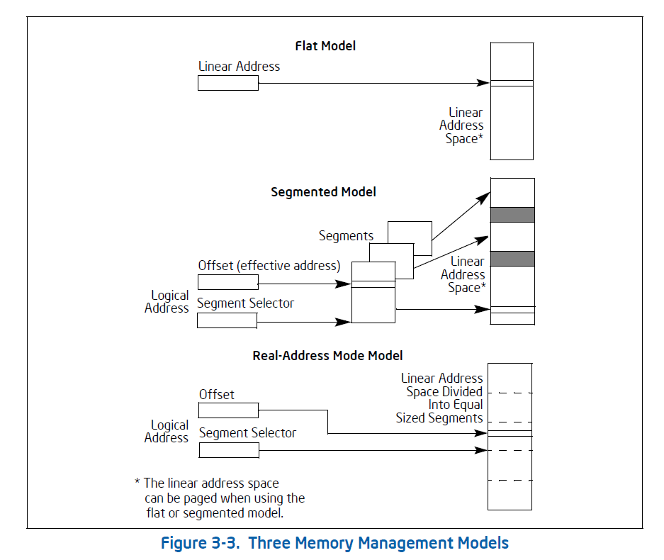

什么是计算机？

------

**字节顺序(Endianness)**

大端(Big endian) 低高低高 低字节存储在高地址 ARM 网络协议

小端(Little endian) 低低高高 低字节存储在低地址  Intel

ARM 支持大端和小端两种模式

------

图灵机

自动机 元胞自动机

冯-诺伊曼架构

------

半导体 晶体管 模拟电路 数字电路 集成电路 PCB 芯片 运算芯片 存储芯片 FGPA SoC

# CPU

CPU 向上(机器代码)提供的两种抽象

1.指令集体系结构或指令集架构(Instruction Set Architecture ISA),  程序运行就好像是一个指令流，一个接一个的执行

2.地址空间，将对物理内存和各设备的访问抽象为对一个大数组的访问

## CPU Architecture

RISC **(Reduced Instruction Set Computer)** ARM RISC-V

CISC **(Complex Instruction Set Computer)**  x86

ISA **(Instruction Set Architecture)**

------

运行模式

运行权限

内存模型

寄存器 通用寄存器/状态寄存器/控制寄存器/内存管理寄存器/调试寄存器

数据类型

寻址

ISA 逻辑/算数运算指令/分支指令/load/store指令/mov 指令

例程调用、中断和异常

------

分页和虚拟地址

多任务

多处理器

超线程

虚拟化

高速缓存 cache

## x86

### 运行模式 Modes of operation

保护模式 Protected mode, virtual-8086 mode

实模式 Real-address mode

SMM System management mode

IA-32e mode  Compatibility mode, 64-bit mode

### 运行权限

### 内存模型 Memory Models

> The memory that the processor addresses on its bus is called **physical memory**. Physical memory is organized as
> a sequence of 8-bit bytes. Each byte is assigned a unique address, called a **physical address**. The physical
> address space ranges from zero to a maximum of 236 − 1 (64 GBytes) if the processor does not support Intel
> 64 architecture.

Flat memory model    **linear address space**  **linear address**

Segmented memory model

Real-address mode memory model

### 寄存器

> • General-purpose registers — Eight 32-bit general-purpose registers are used in non-64-bit modes to address operands in memory. These registers are referenced by
> the names EAX, EBX, ECX, EDX, EBP, ESI EDI, and ESP.
> • Segment registers — The six 16-bit segment registers contain segment pointers for use in accessing memory. These registers are referenced by the names CS, DS, SS, ES, FS, and GS.
> • EFLAGS register — This 32-bit register  is used to provide status and control for basic arithmetic, compare, and system operations.
> • EIP register — This 32-bit register contains the current instruction pointer

### 数据类型

> • Bytes, words, doublewords.
> • Signed and unsigned byte, word, doubleword integers.
> • Near and far pointers.
> • Bit fields.
> • BCD integers.

### 寻址 Operand Addressing

> IA-32 machine-instructions act on zero or more operands. Some operands are specified explicitly and others are
> implicit. The data for a source operand can be located in:
> • The instruction itself (an immediate operand).
> • A register.
> • A memory location.
> • An I/O port.
>
> When an instruction returns data to a destination operand, it can be returned to:
> • A register.
> • A memory location.
> • An I/O port.

1. Immediate Operands
2. Register Operands
3. Memory Operands
4. Specifying a Segment Selector
5. Specifying an Offset
6. Assembler and Compiler Addressing Modes   CSAPP 第三章
7. I/O Port Addressing

### ISA

## ARM

参见 AssemblyLanguage.md

# GPU

# 存储器

# I/O 设备

# Bus

# 参考资料

CSAPP 深入理解计算机系统

Intel64 and IA-32 Architecturs Software Developer's Manual

ARM® Cortex® -A Series Programmer’s Guide for ARMv8-A
